# LR6

## Лабораторная работа №6  
Выполнил: **Федотов А. А., группа 4417**

---

## Ход работы

### **5. Клонировал свой личный удалённый репозиторий на компьютер**
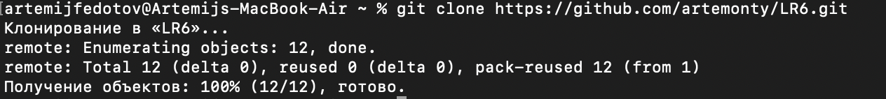

---

### **6. Добавил файл через GitHub, подтянул изменения в локальный репозиторий**
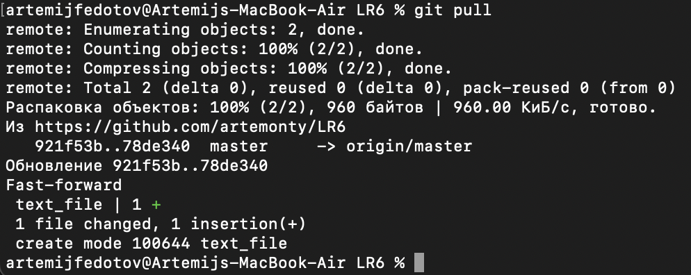

---

### **7. Получил историю операций для каждой из веток**
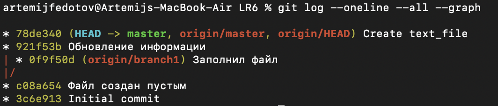

---

### **8. Просмотрел последние изменения**
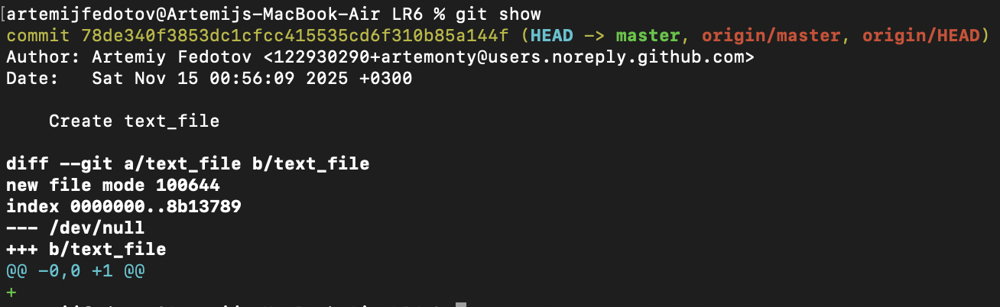

---

### **9. Выполнил слияние в ветку master, разрешив конфликт**
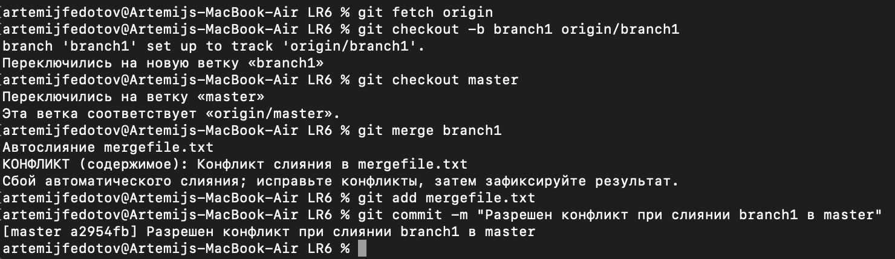

---

### **10. Удалил побочную ветку**
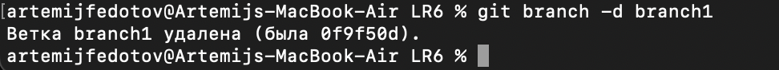

---

### **11. Сделал изменения и зафиксировал их несколько раз**
#### 11.1
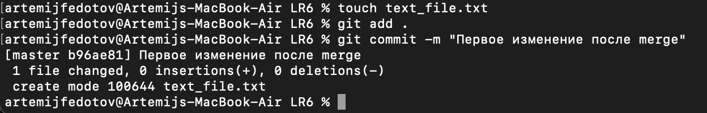

#### 11.2  
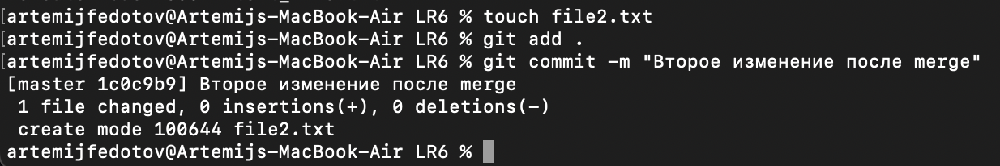

---

### **12. Сделал откат коммита**
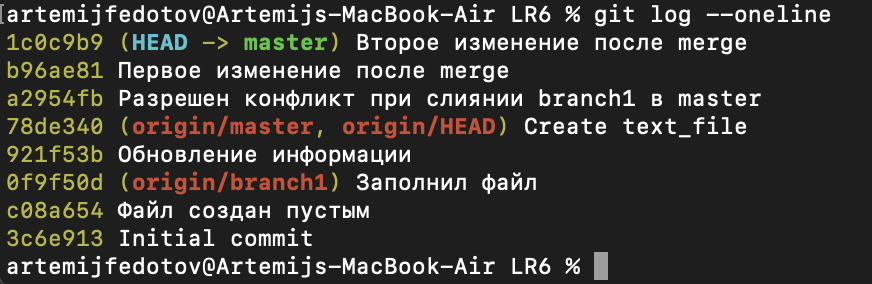

---

### **13. Создал ветку для отчёта**
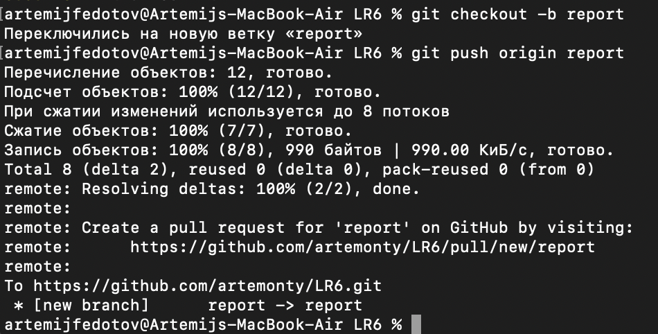

---

### **15. Получил историю операций (форматированный вывод)**
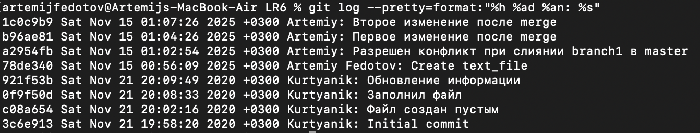

---

## **Вывод**

Изучил базовые возможности системы управления версиями, получил опыт работы с Git API, а также опыт работы с локальными и удалёнными репозиториями.

